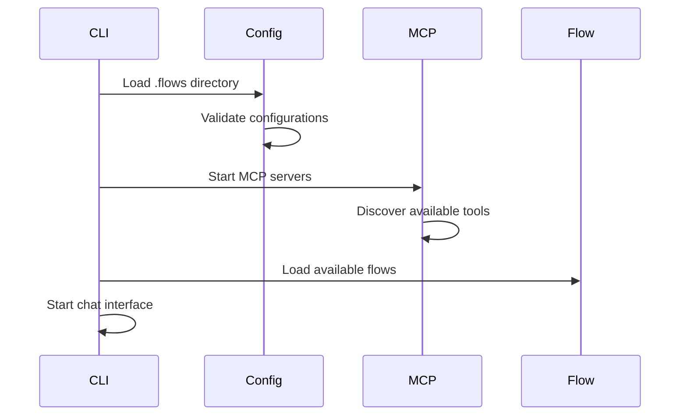
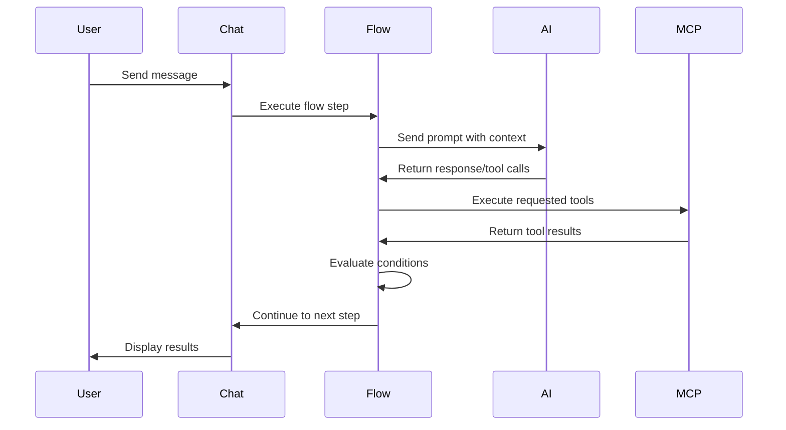

# Architecture Overview

This document provides a high-level overview of the Claude Code CLI architecture, explaining how the different components work together to provide AI-powered development workflows.

## System Overview

```
┌─────────────────┐    ┌─────────────────┐    ┌─────────────────┐
│   User Input    │───▶│  Chat Interface │───▶│  Flow Engine    │
└─────────────────┘    └─────────────────┘    └─────────────────┘
                                                        │
                                                        ▼
┌─────────────────┐    ┌─────────────────┐    ┌─────────────────┐
│  AI Response    │◀───│   AI Provider   │◀───│ Step Execution  │
└─────────────────┘    └─────────────────┘    └─────────────────┘
                                                        │
                                                        ▼
┌─────────────────┐    ┌─────────────────┐    ┌─────────────────┐
│  Tool Results   │◀───│  MCP Servers    │◀───│  Tool Calling   │
└─────────────────┘    └─────────────────┘    └─────────────────┘
```

## Core Components

### 1. Chat Interface Layer (`src/cli/`)

**Purpose**: Provides interactive user interface using Ink (React for CLI)

**Components**:

- `chat.ts` - Main chat loop and message handling
- `renderer.ts` - UI rendering and formatting
- `input-handler.ts` - User input processing and validation

**Responsibilities**:

- Display conversational interface
- Handle user input and commands
- Render AI responses and tool outputs
- Manage chat history and context

### 2. Flow Engine (`src/flows/`)

**Purpose**: Executes JSON-defined workflows with conditional logic

**Components**:

- `flow-loader.ts` - Load and validate flow files
- `flow-executor.ts` - Execute flow steps and manage state
- `condition-evaluator.ts` - Evaluate JavaScript expressions safely
- `types.ts` - Flow type definitions and interfaces

**Flow Execution Process**:

```
Load Flow → Validate → Execute Initial Step → Evaluate Conditions → Next Step
     ↑                                                                 ↓
     └─────────────── Loop until completion or termination ←───────────┘
```

### 3. MCP Integration Layer (`src/mcp/`)

**Purpose**: Manages communication with external MCP servers

**Components**:

- `server-manager.ts` - Lifecycle management of MCP servers
- `client.ts` - MCP protocol implementation
- `tool-registry.ts` - Tool discovery and caching
- `types.ts` - MCP type definitions

**MCP Server Lifecycle**:

```
Configuration → Start Servers → Discover Tools → Register Tools → Handle Requests
      ↓                                                                  ↑
Monitor Health ←─────────────── Restart on Failure ←──────────────────────┘
```

### 4. Configuration Management (`src/config/`)

**Purpose**: Handles loading and validation of `.flows` directory

**Components**:

- `config-loader.ts` - Load flows and server configurations
- `validator.ts` - Validate JSON schemas and references

**Configuration Structure**:

```
.flows/
├── flows/         # Flow definitions
│   └── *.json
└── servers/       # MCP server configurations
    └── *.json
```

### 5. Utility Layer (`src/utils/`)

**Purpose**: Shared utilities and infrastructure

**Components**:

- `logger.ts` - Structured logging with Winston
- `errors.ts` - Custom error classes and handling

## Data Flow

### 1. Initialization



### 2. Flow Execution



## Key Design Patterns

### 1. Dependency Injection

Components receive dependencies through constructor injection:

```typescript
export class FlowExecutor {
  constructor(
    private readonly mcpManager: MCPServerManager,
    private readonly aiProvider: AIProvider,
    private readonly logger: Logger
  ) {}
}
```

### 2. Event-Driven Architecture

Components communicate through events and callbacks:

```typescript
flowExecutor.on('stepCompleted', result => {
  chatInterface.displayResult(result);
});
```

### 3. Plugin Architecture

MCP servers act as plugins providing different capabilities:

```typescript
interface MCPServer {
  name: string;
  capabilities: ServerCapabilities;
  tools: Tool[];
}
```

### 4. State Machine Pattern

Flow execution follows state machine principles:

```typescript
interface FlowState {
  currentStep: string;
  context: FlowContext;
  history: StepResult[];
}
```

## Security Considerations

### 1. Sandboxed Execution

- JavaScript conditions run in isolated VM context
- Tool execution requires explicit permission
- File system access is restricted to configured paths

### 2. Input Validation

- All user inputs are validated and sanitized
- Flow definitions are validated against JSON schemas
- MCP server responses are validated before processing

### 3. Error Isolation

- Server failures don't crash the entire application
- Malformed flows fail gracefully with clear errors
- Tool execution errors are contained and reported

## Scalability Considerations

### 1. Async Operations

- All I/O operations are asynchronous
- Parallel tool execution when possible
- Non-blocking chat interface

### 2. Resource Management

- MCP servers run as separate processes
- Memory usage is monitored and limited
- Tool timeouts prevent hanging operations

### 3. Caching Strategy

- Tool definitions are cached during session
- Flow validation results are cached
- AI responses can be cached for identical prompts

## Extension Points

### 1. New Step Types

Add new flow step types by:

- Defining new step interface
- Implementing step executor
- Registering with flow engine

### 2. Custom MCP Servers

Create custom tool providers:

- Implement MCP protocol
- Define available tools
- Handle tool execution

### 3. AI Provider Integration

Support new AI providers:

- Implement AI provider interface
- Handle authentication and rate limiting
- Convert between message formats

## Performance Optimization

### 1. Lazy Loading

- Flows are loaded on-demand
- Tools are discovered incrementally
- UI components render progressively

### 2. Connection Pooling

- Reuse MCP server connections
- Maintain persistent AI provider sessions
- Cache frequently accessed data

### 3. Memory Management

- Clean up completed flow contexts
- Limit chat history retention
- Use weak references for caches

## Monitoring and Observability

### 1. Structured Logging

All components log structured data:

- Flow execution steps
- MCP server communication
- AI provider interactions
- Error conditions and recovery

### 2. Metrics Collection

Track key performance indicators:

- Flow execution time
- Tool success/failure rates
- AI provider response times
- Memory and CPU usage

### 3. Health Checks

Monitor system health:

- MCP server availability
- AI provider connectivity
- File system access
- Configuration validity

This architecture supports the project's goals of providing a flexible, extensible CLI tool for AI-powered development workflows while maintaining high code quality, security, and performance standards.
