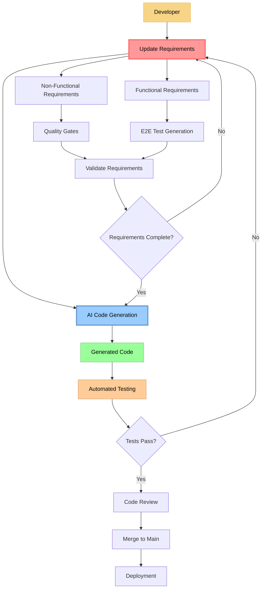

# Requirements-Driven Development Workflow

> **Core Principle**: Developers change requirements, AI generates code. Requirements are the single source of truth for all development.

## Workflow Overview



## Developer Workflow

### Phase 1: Requirements Definition

**Developer Responsibility**: Define what needs to be built, not how to build it

1. **Analyze Task/Issue**
   - Read GitHub issue or feature request
   - Understand business requirements
   - Identify success criteria

2. **Update Requirements Document**
   - Use requirements template (`requirements_template.md`)
   - Define functional requirements with specific outcomes
   - Set non-functional requirements (quality, performance, security)
   - Create acceptance test scenarios

3. **Validate Requirements Completeness**
   - ✅ All functional requirements are measurable
   - ✅ Non-functional requirements have clear thresholds
   - ✅ Acceptance criteria are testable
   - ✅ 1:1 mapping between requirements and test scenarios

### Phase 2: AI Code Generation

**AI Responsibility**: Generate code that satisfies all requirements

1. **Requirements Analysis**
   - AI reads updated requirements document
   - Identifies code changes needed
   - Plans implementation approach

2. **Code Generation**
   - Generate implementation code
   - Create/update tests to match requirements
   - Update documentation as needed

3. **Quality Validation**
   - Ensure generated code meets all non-functional requirements
   - Verify test coverage matches functional requirements
   - Check code quality standards

### Phase 3: Automated Validation

**System Responsibility**: Verify requirements satisfaction

1. **Test Execution**
   - Run all E2E tests (must match functional requirements 1:1)
   - Execute unit tests with coverage validation
   - Perform linting and static analysis

2. **Quality Gates**
   - ✅ All tests pass
   - ✅ Code coverage meets thresholds
   - ✅ Linting passes with zero errors
   - ✅ Performance benchmarks met

3. **Requirements Traceability**
   - Verify each requirement has corresponding test
   - Confirm all acceptance criteria are validated
   - Check that no functionality is missing

## Requirements as Source of Truth

### Requirements Document Structure

```
requirements.md
├── FUNCTIONAL SPECIFICATION
│   ├── Feature System A
│   │   ├── Requirement 1 (testable, measurable)
│   │   └── Requirement 2 (testable, measurable)
│   └── Feature System B
│       ├── Requirement 1 (testable, measurable)
│       └── Requirement 2 (testable, measurable)
└── NON-FUNCTIONAL SPECIFICATION
    ├── Quality
    │   ├── Test Coverage Requirements
    │   ├── Code Quality Standards
    │   └── Review Process Requirements
    ├── Performance
    │   ├── Response Time Limits
    │   └── Resource Usage Thresholds
    └── Security
        ├── Data Protection Requirements
        └── Input Validation Standards
```

### Change Management Process

#### Adding New Functionality

1. **Developer**: Add new functional requirement to `requirements.md`
2. **Developer**: Define acceptance test scenarios
3. **Developer**: Set quality criteria
4. **AI**: Generate implementation and tests
5. **System**: Validate all requirements are satisfied

#### Modifying Existing Functionality

1. **Developer**: Update existing requirement in `requirements.md`
2. **Developer**: Modify acceptance criteria as needed
3. **AI**: Refactor code to match updated requirements
4. **System**: Ensure backward compatibility unless explicitly changed

#### Bug Fixes

1. **Developer**: Add new requirement that prevents the bug
2. **Developer**: Create test scenario that would catch the bug
3. **AI**: Generate fix that satisfies the new requirement
4. **System**: Verify fix doesn't break existing requirements

## Benefits of This Approach

### For Developers

- **Focus on "what" not "how"**: Define outcomes, let AI handle implementation
- **Reduced cognitive load**: No need to think about code structure, just requirements
- **Better requirement clarity**: Forces explicit, testable requirements
- **Consistent quality**: AI ensures all code meets standards

### For Teams

- **Living documentation**: Requirements always match actual implementation
- **Faster onboarding**: New team members read requirements, not code
- **Reduced technical debt**: AI generates consistent, high-quality code
- **Better testing**: 1:1 mapping between requirements and tests

### For Projects

- **Predictable outcomes**: Clear requirements lead to predictable results
- **Easier maintenance**: Changes are made at requirement level
- **Better traceability**: Every feature traces back to explicit requirement
- **Quality assurance**: Non-functional requirements enforce quality gates

## Workflow Tools

### Required Templates

- `requirements_template.md`: Structured format for requirements
- `task_template.md`: Task initialization with success criteria
- `init_task_instruction.md`: AI instructions for task setup

### Quality Gates

- All E2E tests must pass
- Unit test coverage ≥ 80% (100% for critical paths)
- ESLint/TypeScript strict mode compliance
- All PR review comments addressed
- Performance benchmarks met

### Validation Process

- Requirements completeness check
- Test-requirement mapping validation
- Code generation verification
- Quality gate enforcement

## Success Criteria

This workflow is successful when:

✅ **Developer never writes implementation code directly**
✅ **All code changes originate from requirement updates**
✅ **100% test coverage of requirements (1:1 mapping)**
✅ **AI-generated code meets all quality standards**
✅ **Requirements document is always up-to-date with implementation**
✅ **New team members can understand system by reading requirements only**
✅ **Bug fixes and features are delivered faster than traditional development**

---

## Getting Started

1. **Initialize Task**: Use `INIT` command with success criteria focus
2. **Load Templates**: Use requirements and task templates
3. **Define Requirements**: Write clear, measurable functional and non-functional requirements
4. **Generate Code**: Let AI implement based on requirements
5. **Validate**: Ensure all quality gates pass
6. **Review**: Verify requirements satisfaction in code review
7. **Deploy**: Ship with confidence that requirements are met

**Remember**: Requirements are code. Code is generated. Quality is automated.

---

## Related Documentation

- [Project Overview](../README.md)
- [Memory Bank System](../memory-bank/)
- [Custom Modes](../custom_modes/)
- [Testing Strategy](../tests/)

## Navigation

- **[Home](../README.md)**
- **[Development Workflow](Requirements-Driven-Development-Workflow.md)** ← You are here
- **[Requirements Templates](../custom_modes_new/)**
- **[Testing Guide](../tests/README.md)**
