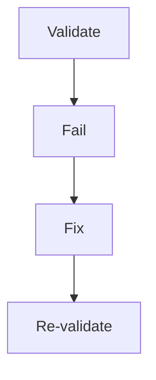
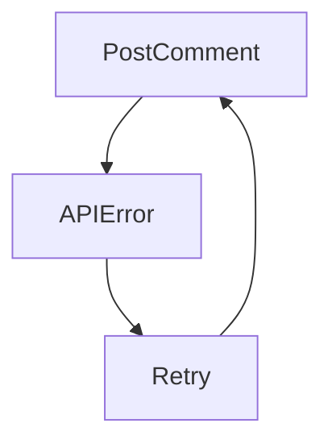

# Creative Phase: Clarify Task Requirements

## Architecture Design: Requirement Analysis Service

### Selected Architecture: Strategy Pattern with Analyzers

The requirement analysis service will use a strategy pattern to support multiple types of analysis (completeness, ambiguity, conflicts) with a coordinated main service. This provides:

- **Extensibility**: Easy to add new analyzer types
- **Testability**: Each analyzer can be tested independently
- **Maintainability**: Clear separation of concerns
- **Integration**: Works well with existing DI container patterns

Key components:

- `RequirementAnalysisService`: Main orchestrator
- `IRequirementAnalyzer`: Strategy interface for analyzers
- `CompletenessAnalyzer`: Checks requirement completeness
- `AmbiguityAnalyzer`: Detects ambiguous statements
- `QuestionGenerator`: Creates clarifying questions

## Algorithm Design: Ambiguity Detection

### Selected Algorithm: Simplified Hybrid Approach

Starting with rule-based pattern matching, with the ability to add statistical analysis later:

1. **Pattern Matching Phase**:
   - Detect vague terms (maybe, possibly, might)
   - Find unquantified metrics (fast, slow, big)
   - Identify unclear references (it, user, system)
   - Check for incomplete lists (etc, and so on)

2. **Context Enhancement**:
   - Extract surrounding context for each ambiguity
   - Group related ambiguities
   - Assign severity levels

3. **Question Generation**:
   - Template-based question creation
   - Context-aware variable substitution
   - Priority-based ordering

This approach balances accuracy with implementation simplicity and can be enhanced over time.

## VAN Mode Integration Insights

The VAN mode demonstrates a sophisticated approach that we can apply to the clarify-requirements step:

### 1. Multi-Phase Validation Pattern

VAN mode uses distinct phases with checkpoints:

- **Initial Analysis** → Platform detection, file verification
- **Technical Validation** → Dependencies, configuration, environment
- **Build Verification** → Minimal build test

Applied to clarify-requirements:

- **Requirement Analysis** → Extract and parse requirements
- **Completeness Validation** → Check for missing information
- **Ambiguity Detection** → Identify unclear specifications
- **Context Enhancement** → Analyze related issues

### 2. Checkpoint System

VAN uses explicit checkpoints with YES/NO validation:

```
✓ PLATFORM CHECKPOINT
- OS detected? [YES/NO]
- Commands adapted? [YES/NO]
```

For clarify-requirements:

```
✓ ANALYSIS CHECKPOINT
- Requirements extracted? [YES/NO]
- Completeness score calculated? [YES/NO]
- Ambiguities identified? [YES/NO]
```

### 3. Mode Transition Signals

VAN provides clear transition messages:

```
⏭️ NEXT MODE: VAN QA
Type "VAN QA" to continue
```

For clarify-requirements in a flow:

```
✅ CLARIFICATION COMPLETE
Moving to next step: [step-name]
```

### 4. Error Recovery Pattern

VAN QA shows retry logic:



Applied to our step:



### 5. Comprehensive Logging

VAN mode logs every decision point for debugging. Our step should log:

- Analysis initiation
- Each ambiguity detected
- Completeness score calculation
- Question generation process
- API interactions
- Final decisions

## Implementation Alignment with VAN Pattern

The clarify-requirements step will mirror VAN's structured approach:

1. **Clear Phase Boundaries**: Each phase has entry/exit logging
2. **Explicit Checkpoints**: Validation at each critical point
3. **Graceful Degradation**: Continue with partial success where possible
4. **Comprehensive Error Handling**: Retry logic for transient failures
5. **State Management**: Track clarification state throughout process
